<div align="center">
  <h1>SignSpeak 🤟</h1>
  <p><b>Real-Time Sign Language Translator & Smart Assistant</b></p>
</div>

SignSpeak is a modern, lightning-fast web application that translates American Sign Language (ASL) into English text and translated Hindi audio in real-time. It uses your computer's webcam to track your hands and machine learning to predict the signs you are making.

This project was built with a rich, premium, minimalistic user interface and an incredibly optimized AI pipeline.

---

## 🟢 START HERE — Run SignSpeak (No Coding Needed)

**First time?** Install Python and Node.js once (see [Setup Guide](#-ultimate-beginners-setup-guide) below). **Already installed?** Use one of these:

### Mac — Double-click to run
1. Open the **SignSpeak** folder (e.g. in Finder: `Downloads` → `SignSpeak`).
2. **Double-click** `run_mac.command`.
3. *If macOS says "cannot be opened":* Right-click `run_mac.command` → **Open** → **Open** (first time only).
4. A Terminal window opens. Wait until you see "SignSpeak is running successfully!"
5. Your browser opens automatically. If not, press `Cmd + L`, type `localhost:5173`, press `Enter`.
6. **To quit:** In the Terminal window, press `Ctrl + C`.

### Mac — Keyboard only
1. Press `Cmd + Space` (opens Spotlight).
2. Type `Terminal` and press `Enter`.
3. Type `cd ~/Downloads/SignSpeak` and press `Enter`. *(Change path if you saved SignSpeak elsewhere.)*
4. Type `bash run_mac.sh` and press `Enter`.
5. Wait for "SignSpeak is running successfully!" — browser opens automatically.
6. **To quit:** Press `Ctrl + C` in Terminal.

### Windows — Double-click to run
1. Open **File Explorer** (press `Win + E`).
2. Go to the **SignSpeak** folder (e.g. `Downloads` → `SignSpeak`).
3. **Double-click** `run_windows.bat`.
4. Two black windows open. Wait for the browser to open.
5. **To quit:** Close both black windows (click X or press `Alt + F4`).

### Windows — Keyboard only
1. Press `Win` (opens Start).
2. Type `cmd` and press `Enter`.
3. Type `cd %USERPROFILE%\Downloads\SignSpeak` and press `Enter`. *(Change path if needed.)*
4. Type `run_windows.bat` and press `Enter`.
5. Two black windows open. Browser opens automatically.
6. **To quit:** Press `Alt + F4` on each black window.

---

## 📐 Architecture & Data Flow

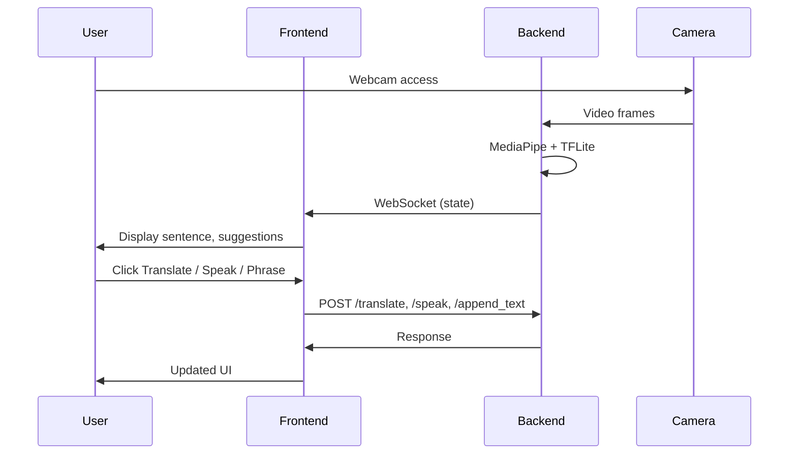

---

## 📐 System Architecture

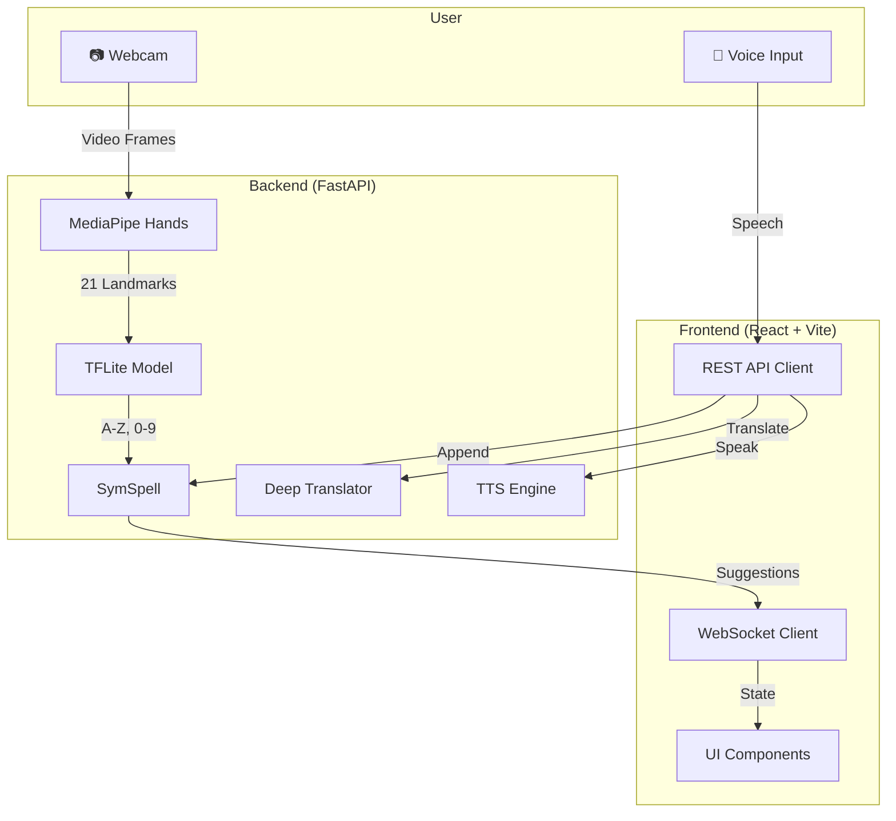

---

## ✨ Features

### Real-Time Hand Tracking

Uses Google's MediaPipe to draw skeletal structures over your hands instantly.

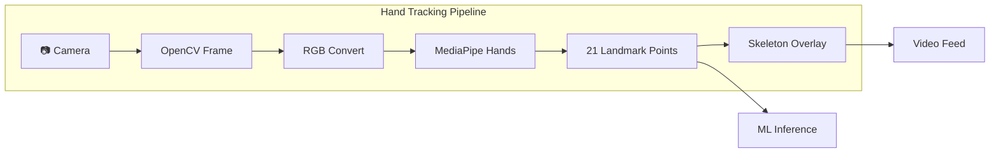

### Machine Learning Inference

A lightweight TensorFlow Lite model predicts ASL alphabet characters (A-Z), numbers (0-9), and special actions incredibly fast.

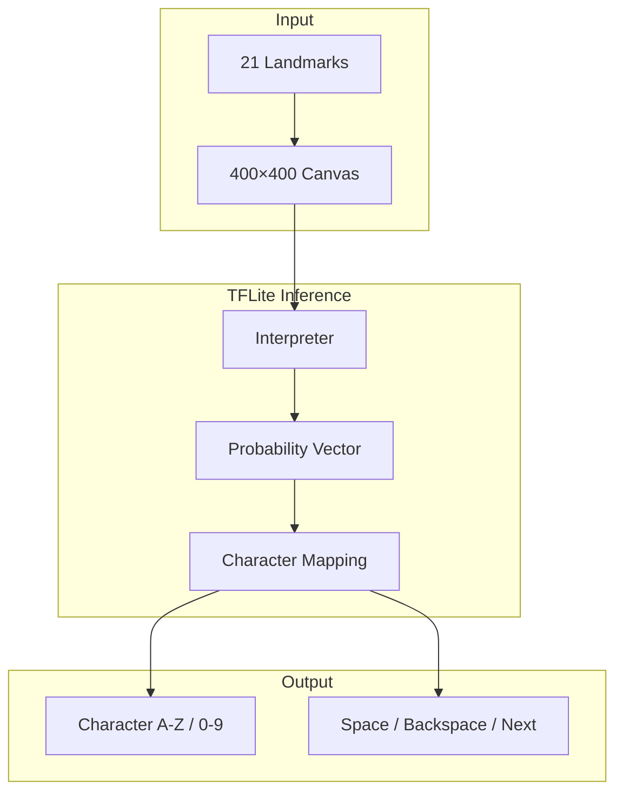

### Smart Auto-Correction

As you spell out words, Symmetric Delete spelling correction (SymSpell) predicts what word you are trying to say and offers clickable suggestions.

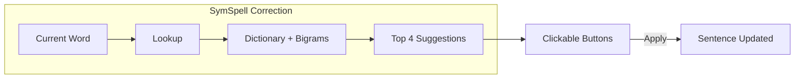

### English to Hindi Translation

With the click of a button, your English sentences are translated to Hindi.

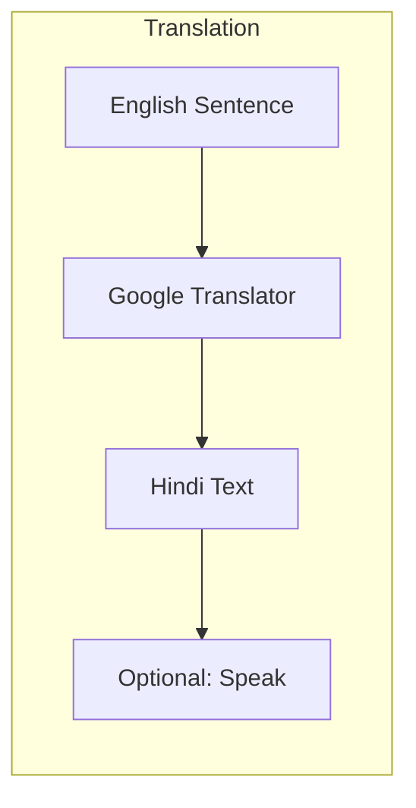

### Text-to-Speech

Uses Microsoft Edge Neural TTS engines for lifelike English voices, and Google TTS for flawless Hindi audio playback.

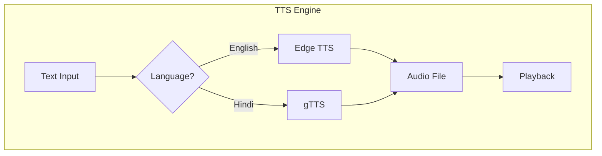

### Gesture UI Control

Control the entire app without a keyboard!

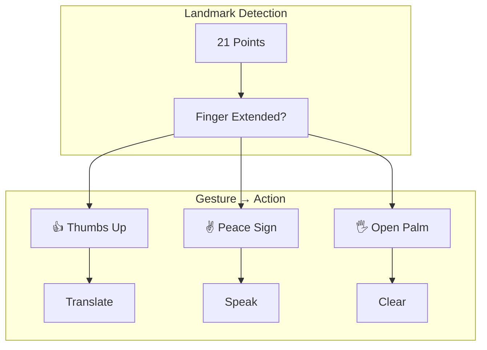

| Gesture | Action |
|---------|--------|
| 👍 Thumbs Up | Translate |
| ✌️ Peace Sign | Speak |
| 🖐 Open Palm | Clear text |

### ASL Numbers (0–9)

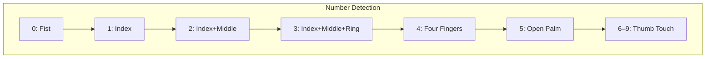

### Voice Input & Quick Phrases

```mermaid
flowchart LR
    subgraph Voice["Voice Input"]
        V[🎤 Voice]
        V --> W[Web Speech API]
        W --> T[Transcribed Text]
        T --> A[/append_text]
    end

    subgraph Phrases["Quick Phrases"]
        P1[Hello]
        P2[Thank you]
        P3[Help]
        P1 --> A
        P2 --> A
        P3 --> A
    end

    A --> S[Sentence]
```

### Dark/Light Mode

A gorgeous, pure-monochrome aesthetic that supports one-click theme switching.

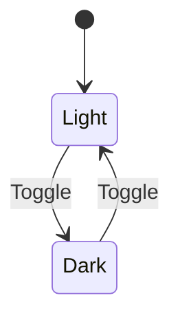

---

## 🛠 Tech Stack

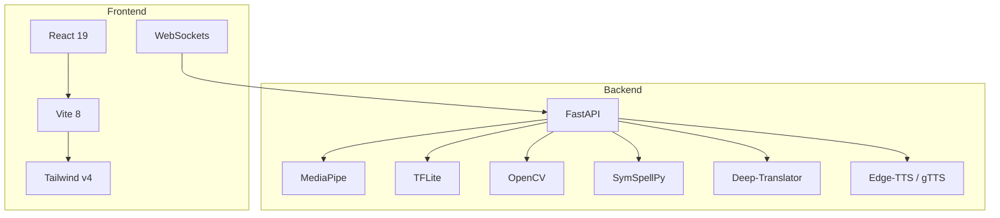

| Layer | Technology |
|-------|------------|
| **Frontend** | React.js, Vite, Tailwind CSS v4, WebSockets |
| **Backend** | Python, FastAPI |
| **Vision** | MediaPipe, OpenCV |
| **ML** | TensorFlow Lite |
| **Language** | SymSpellPy, Deep-Translator, gTTS, Edge-TTS |

### Project Structure

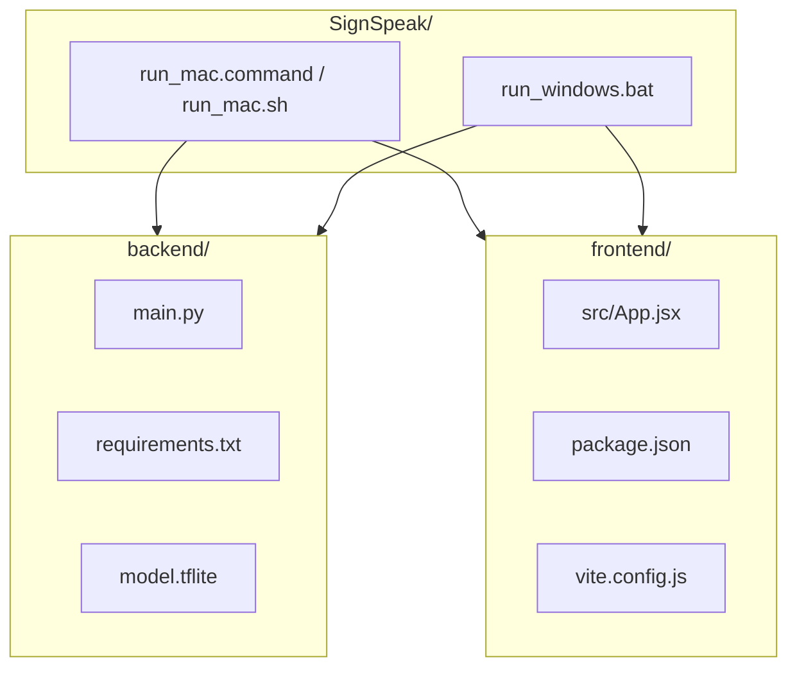

---

## 🚀 Ultimate Beginner's Setup Guide

Don't know how to code? Never used Python before? **No problem.** Follow these steps exactly, and you will have SignSpeak running on your computer in 10 minutes.

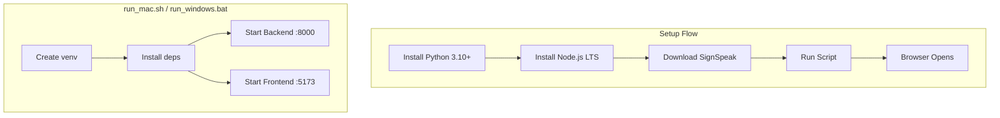

### Step 1: Install Python (The Backend Engine)

| Action | What to do |
|--------|------------|
| 1 | Press `Cmd + T` (Mac) or `Win + T` (Windows) to open a new browser tab. |
| 2 | Type `python.org/downloads` and press `Enter`. |
| 3 | Click the yellow **Download Python 3.x** button. |
| 4 | Open the downloaded file (check your Downloads folder). |
| 5 | **Windows only:** On the first screen, **check the box** at the bottom: "Add Python to PATH". |
| 6 | Click **Install Now** (Mac) or **Next** until done (Windows). |
| 7 | When finished, click **Close**. |

### Step 2: Install Node.js (The Frontend Engine)

| Action | What to do |
|--------|------------|
| 1 | In your browser, type `nodejs.org` and press `Enter`. |
| 2 | Click the green **LTS** download button. |
| 3 | Open the downloaded file. |
| 4 | Click **Next** through all screens (keep defaults). |
| 5 | Click **Install**, then **Finish**. |
| 6 | **Restart your computer** (recommended). |

### Step 3: Download SignSpeak

| Action | What to do |
|--------|------------|
| 1 | Download the SignSpeak folder to your computer. |
| 2 | Extract/unzip it if needed. |
| 3 | Remember where you saved it (e.g. `Downloads` or `Desktop`). |

### Step 4: Run the App

See **[START HERE](#-start-here--run-signspeak-no-coding-needed)** at the top for the simplest way to run. Summary:

- **Mac:** Double-click `run_mac.command` — or open Terminal, type `cd` then space, drag the SignSpeak folder into the window, press Enter, then type `bash run_mac.sh` and press Enter.
- **Windows:** Double-click `run_windows.bat` — or press `Win`, type `cmd`, Enter, type `cd %USERPROFILE%\Downloads\SignSpeak`, Enter, then type `run_windows.bat`, Enter.

### Step 5: Use the App

| Action | What to do |
|--------|------------|
| 1 | Your browser should open automatically. If not: press `Cmd + L` (Mac) or `Ctrl + L` (Windows), type `localhost:5173`, press `Enter`. |
| 2 | When asked for **Camera**, click **Allow** (or press `Enter` if it's focused). |
| 3 | You should see your webcam and hand skeleton. Start signing! |

---

## 🕹 How to use SignSpeak

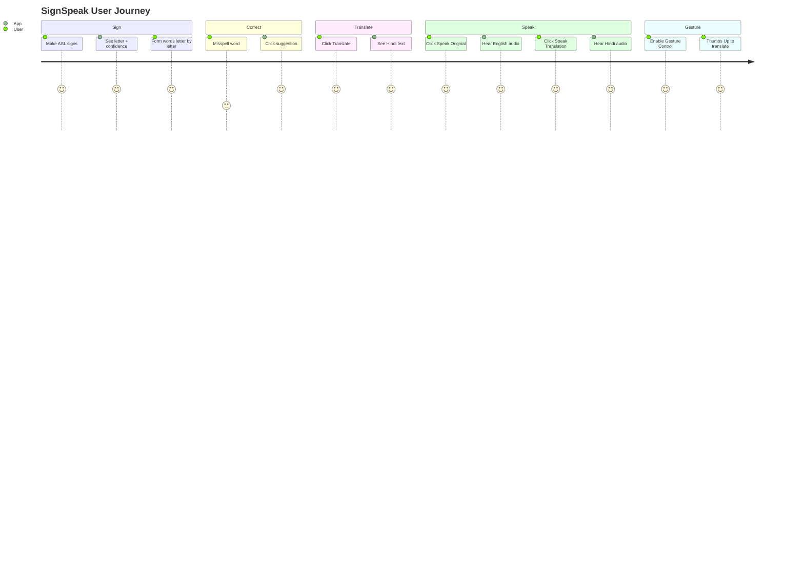

1. **Making Signs:** Hold your hand up to the camera and make ASL alphabet signs. The app will detect the letter and show the confidence percentage.
2. **Forming Words:** Form letters one by one. The `Backspace` sign deletes a letter. The `Space` sign finishes a word. 
3. **Suggestions:** If you misspell a word, look at the "Suggestions" box. Click the correct word to automatically fix your sentence!
4. **Translation:** Click the black `Translate` button to instantly convert your English sentence to Hindi.
5. **Speech:** Click `Speak Original` to hear an English voice, or `Speak Translation` to hear a pristine Hindi voice read your sentence out loud.
6. **Gesture Control:** Click "Gesture Control" at the top right. Now, you can perform a Thumbs Up to translate, a Peace Sign to speak, or an Open Palm to clear the text, entirely hands-free!

### Keyboard shortcuts (while using the app)

| Key | Action |
|-----|--------|
| `Tab` | Move between buttons (Translate, Speak, Clear, etc.) |
| `Enter` or `Space` | Activate the focused button |
| `Cmd + L` (Mac) / `Ctrl + L` (Windows) | Focus address bar — type `localhost:5173` to open app |

## 🔌 API Overview

```mermaid
flowchart TB
    subgraph HTTP["HTTP Endpoints"]
        V[GET /video_feed]
        S[GET /skeleton_feed]
        T[POST /translate]
        SP[POST /speak]
        C[POST /clear]
        A[POST /apply_suggestion]
        AP[POST /append_text]
        G[POST /toggle_gesture]
    end

    subgraph WS["WebSocket"]
        W[/ws - Real-time state]
    end
```

## 🛑 Troubleshooting

| Problem | What to do (keyboard-friendly) |
|---------|--------------------------------|
| **Camera is black** | Close Zoom, Skype, or any app using the webcam. Press `Cmd + Q` (Mac) or `Alt + F4` (Windows) to quit them. |
| **"pip is not recognized"** (Windows) | Python wasn't added to PATH. Uninstall Python, re-download, and **check "Add Python to PATH"** before installing. |
| **"npm is not recognized"** | Node.js not installed or not in PATH. Install Node.js from nodejs.org, then restart your computer. |
| **"run_mac.command cannot be opened"** (Mac) | Right-click the file → **Open** → **Open**. Or use Terminal: `cd` to SignSpeak folder, type `bash run_mac.sh`, Enter. |
| **App is laggy** | Plug in your laptop. Close other apps. |
| **Browser didn't open** | Press `Cmd + L` (Mac) or `Ctrl + L` (Windows), type `localhost:5173`, press `Enter`. |

---

*Built with ❤️ utilizing FastAPI, React, and TensorFlow Lite.*
